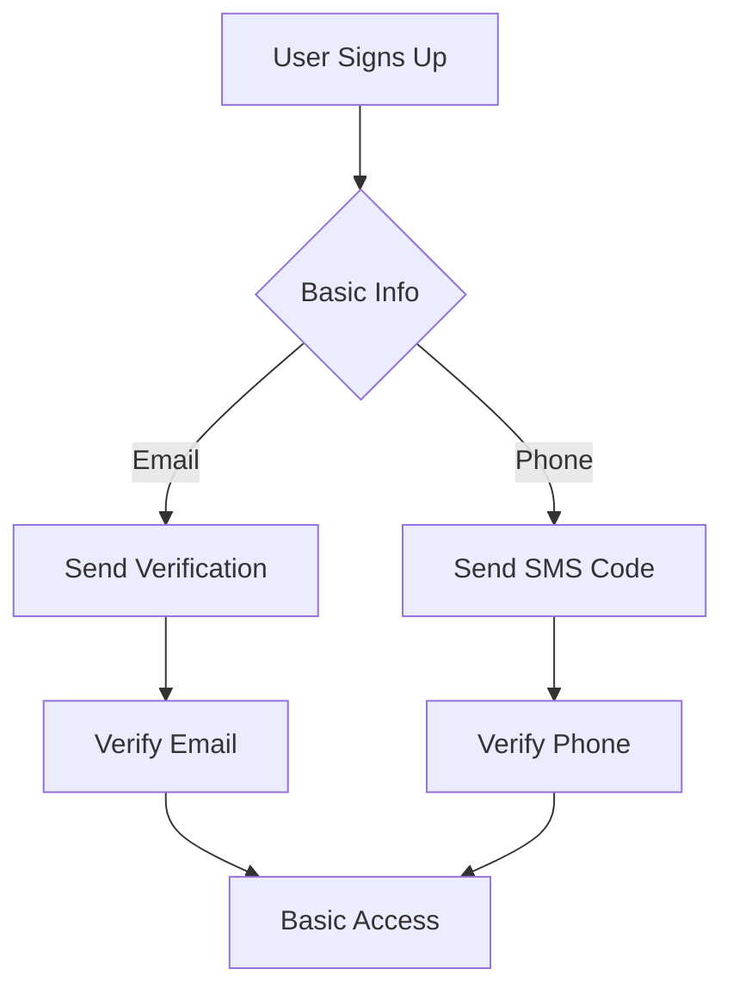
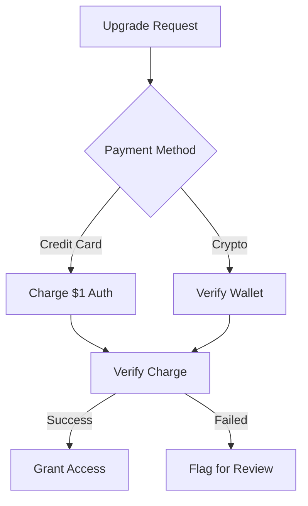

# GHOST IP Monetization Framework

## Monetization Models

### 1. Licensing Tiers
| Tier | Features | Price (Annual) | Human Verification Required |
|------|----------|----------------|----------------------------|
| Basic | Core IDE, Basic AI | $99 | Email + Phone |
| Pro | Advanced AI, Plugins | $499 | ID + Payment Method |
| Enterprise | Custom Solutions | Custom | Contract + Legal Review |

### 2. Usage-Based Billing
- **AI API Calls**: $0.01 per 1000 tokens
- **Storage**: $0.10/GB/month
- **Compute**: $0.20/vCPU/hour

### 3. Marketplace Revenue Share
- 30% platform fee on all marketplace transactions
- Automatic payout to verified accounts

## Human Verification Flow

### 1. Initial Verification


### 2. Payment Verification


## Integration Points

### 1. VSCode Extension
```json
{
  "name": "ghost-ide",
  "displayName": "GHOST IDE",
  "publisher": "ghostlabs",
  "version": "1.0.0",
  "engines": {
    "vscode": "^1.70.0"
  },
  "contributes": {
    "configuration": {
      "title": "GHOST IDE",
      "properties": {
        "ghost.licenseKey": {
          "type": "string",
          "default": "",
          "description": "Your GHOST IDE license key"
        }
      }
    }
  }
}
```

### 2. Web IDE Integration
```javascript
class GhostLicenseManager {
  constructor() {
    this.licenseKey = localStorage.getItem('ghost_license_key');
    this.verificationStatus = 'unverified';
  }

  async verifyLicense() {
    const response = await fetch('https://api.ghostide.ai/verify', {
      method: 'POST',
      headers: { 'Content-Type': 'application/json' },
      body: JSON.stringify({ key: this.licenseKey })
    });
    
    if (response.ok) {
      this.verificationStatus = 'verified';
      return true;
    } else {
      this.verificationStatus = 'verification_required';
      this.promptHumanVerification();
      return false;
    }
  }
}
```

## Revenue Tracking

### 1. Database Schema
```sql
CREATE TABLE license_verifications (
    id SERIAL PRIMARY KEY,
    user_id UUID NOT NULL,
    verification_type VARCHAR(50) NOT NULL,
    status VARCHAR(20) NOT NULL,
    created_at TIMESTAMP DEFAULT NOW(),
    verified_at TIMESTAMP,
    metadata JSONB
);

CREATE TABLE revenue_events (
    id SERIAL PRIMARY KEY,
    user_id UUID NOT NULL,
    amount DECIMAL(10,2) NOT NULL,
    currency VARCHAR(3) DEFAULT 'USD',
    event_type VARCHAR(50) NOT NULL,
    status VARCHAR(20) DEFAULT 'pending',
    created_at TIMESTAMP DEFAULT NOW()
);
```

## Compliance & Security

### 1. Data Protection
- All payment data encrypted at rest (AES-256)
- PCI-DSS compliant payment processing
- Regular security audits

### 2. Human Review Queue
```python
class HumanReviewQueue:
    def __init__(self):
        self.queue = []
        self.lock = threading.Lock()
    
    def add_to_queue(self, verification_request):
        with self.lock:
            self.queue.append({
                'id': str(uuid.uuid4()),
                'type': verification_request['type'],
                'user_id': verification_request['user_id'],
                'status': 'pending',
                'created_at': datetime.utcnow()
            })
    
    def get_next_review(self):
        with self.lock:
            if self.queue:
                return self.queue.pop(0)
        return None
```

## Getting Started

1. **For Users**:
   ```bash
   # Install GHOST IDE extension
   code --install-extension ghostlabs.ghost-ide
   
   # Set your license key
   code --set-extension-setting ghost.licenseKey YOUR_LICENSE_KEY
   ```

2. **For Developers**:
   ```bash
   # Clone the repository
   git clone https://github.com/ghostlabs/ghost-ide.git
   
   # Install dependencies
   npm install
   
   # Start development server
   npm run dev
   ```

## Support
For assistance with licensing or verification:
- Email: support@ghostide.ai
- Phone: +1 (555) 123-4567

---
© 2025 Khallid Hakeem Nurse - All Rights Reserved
*This document contains proprietary information of GHOST Labs*
